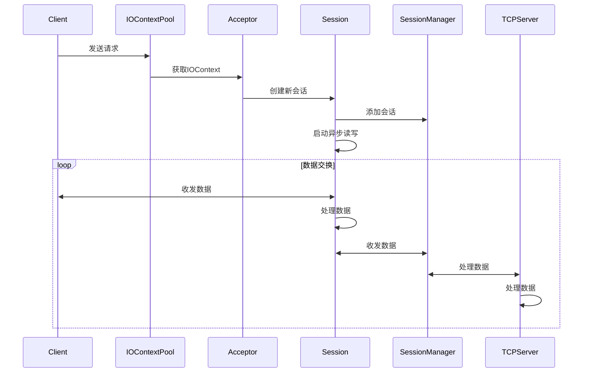

# CommonUtils.TCP

CommonUtils.TCP 是一个基于 Boost.Asio 的 C++ TCP 通信库，提供了 异步服务器 和 同步客户端 的封装。以下是主要类和方法的使用说明。


## 🔧 依赖项

- [Boost.Asio](https://www.boost.org/doc/libs/1_78_0/doc/html/boost_asio.html)：C++ 网络编程库。
- CommonUtils.MessageQueue

---

## 📚 简介

Boost.Asio 是一个 C++ 网络编程库，提供了异步 I/O 和事件驱动模型。

### 名词介绍
1. **IO Context**：是Boost.Asio 库中的‌核心调度器‌或‌事件循环管理器，负责调度和执行异步 I/O 操作（如异步连接、异步读、异步写）。它内部运行着一个‌事件循环‌（可以通过 `io_context.run()` 启动），不停地检查是否存在需要操作的事件。当异步操作完成、定时器到期或用户任务需要执行时，`io_context` 负责调用预先注册好的‌完成处理函数‌（Completion Handler）或回调函数（Callback）
2. **Socket**：是操作系统提供的一个‌抽象句柄‌，代表了网络通信的一个端点，用于应用程序进行网络数据传输（发送和接收）的‌核心接口，封装了操作系统底层的 Socket API。


### 实现方案
我们实现了以下几个类来完成不同的操作：
1. **Session**: 每个连接由一个独立的`Session`对象处理，用来管理Socket的生命周期，进行数据的读写。
2. **SessionManager**: `SessionManager`类管理所有的`Session`对象，提供管理、销毁Session对象的功能，支持消息广播等功能。
3. **IOContextPool**：`IOContextPool`类管理多个`io_context`对象，实现多线程I/O任务调度，提供轮询查找功能。
4. **Acceptor**：Acceptor类用于监听端口，接收新的连接请求，并创建新的`Session`对象。
5. **TCPServer**：创建服务器对象，并启动服务器监听。
6. **TCPClient**：创建客户端对象，并连接服务器。

任务流程图如下所示


为了化简命名，该模块使用了大量的`using`定义类型别名，详情查看[BasicType.hpp](./include/Utils/TCP/BasicType.hpp)文件。

#### Session
`Session` 类的定义位于[Session.hpp](./include/Utils/TCP/Session.hpp)，实现位于[Session.cpp](./src/Session.cpp)。  
在这个类里面，我们主要维护一个`TCPSocket`对象，并提供启动、停止、收发数据，超时判断等若干基本接口。对于消息的处理，`Session`类支持函数回调，即在收到数据时，会调用用户定义的回调函数，将数据传递给用户。其主要函数接口如下：
```cpp
class Session : public std::enable_shared_from_this<Session> {
    public:
        using MessageHandler = std::function<void(SessionPtr, const std::string&)>;
        void Start();
        void Close();
        void SentData(const std::string& data);
        void SetMessageHandler(MessageHandler messageHandler);
};
```

#### SessionManager
`SessionManager` 类的定义位于[Session.hpp](./include/Utils/TCP/Session.hpp)，实现位于[Session.cpp](./src/Session.cpp)。  
`SessionManager` 类用于管理会话，并实现会话的、管理、关闭等功能，通过维护一个 `Session` 列表来管理所有会话，并为每个会话提供一个id。该类还支持消息广播和超时检测。其主要接口如下：
```cpp
using SessionPtr = std::shared_ptr<Session>;
class SessionManager {
    public:
        int AddSession(SessionPtr sessionPtr);
        void RemoveSession(int sessionId);
        void Unicast(int sessionId, const std::string& data);
        void Broadcast(const std::string& data);
    private:
        std::unordered_map<int, SessionPtr> sessions_;
};
```

#### IOContextPool
`IOContextPool` 类的定义位于[Acceptor.hpp](./include/Utils/TCP/Acceptor.hpp)，实现位于[Acceptor.cpp](./src/Acceptor.cpp)。    
`IOContextPoo`l 类用于管理多个 `IOContext` 对象，并确保每个 `IOContext` 对象都运行在单独的线程上；考虑到性能影响，线程的最大值为CPU核数的一半。该类对外提供一个接口用于获取一个 `IOContext` 对象。其主要接口如下：
```cpp
class IOContextPool {
    public:
        void Start();
        void Stop();
        IOContext& GetIOContext();
};
```

#### Acceptor
`Acceptor` 类的定义位于[Acceptor.hpp](./include/Utils/TCP/Acceptor.hpp)，实现位于[Accepptor.cpp](./src/Acceptor.cpp)。  
`Acceptor` 类用于监听TCP连接，并接收新的连接请求，内部维护一个`IOCOntextPool`对象。`Acceptor` 类同样支持用户自定义回调函数，在监听到新的连接请求时，会调用用户自定义的回调函数。其主要接口如下：
```cpp
using TCPSocketPtr = std::shared_ptr<TCPSocket>;
using ConnectionHandler = std::function<void(TCPSocketPtr)>;
class Acceptor {
    public:
        void Start(ConnectionHandler connectionHandler);
        void Stop();
};
```

## 💻 示例代码

### 服务端

#### 1. 创建服务器对象
```cpp
using namespace Utils::TCP;
TCPServer server(8080, "0.0.0.0");
server.Start();
```

#### 2. 获取客户端发来的数据
```cpp
TCPMessage message;
server.GetMessage(message);
```
客户端收到的数据以`TCPMessage`结构体形式返回，包含时间、客户端地址和数据。结构体定义如下：
```c++
struct TCPMessage {
    TimePoint time;
    int sessionId;
    int port;
    std::string ip;
    std::string data;
};
```
详细描述请查看[BasicType.hpp](./include/Utils/TCP/BasicType.hpp)文件

#### 3. 发送数据给客户端
```cpp
server.Unicast(sessionID, "Hello, Client!");
server.Broadcast("Hello, All Clients!");
```

#### 4. 关闭客户端
```cpp
server.CloseSession(sessionID);
```

#### 5. 关闭服务器
```cpp
server.Stop();
```

### 客户端
####  1. 创建客户端对象
```cpp
using namespace Utils::TCP;
TCPClient client("127.0.0.1", 8080);
client.ConnectToServer();
```

#### 2. 发送数据
```cpp
client.SendData("Hello, Server!");
```

####  3. 接收数据
```cpp
std::string message;
client.RecData(message);
```

#### 4. 断开连接
```cpp
client.CloseConnection();
```


## 💡 注意事项
* 请确保 Boost.Asio 库已正确安装。
* 在实际使用中，请务必处理异常和错误。
* `TCPServer` 内部使用了异步 I/O 和独立线程运行，但其本身不是线程安全的，操作时需注意并发访问。

欢迎通过Issue提交建议！
> Made by Motues with ❤️
